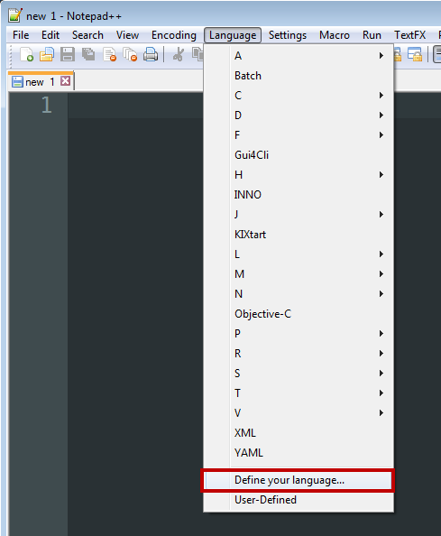
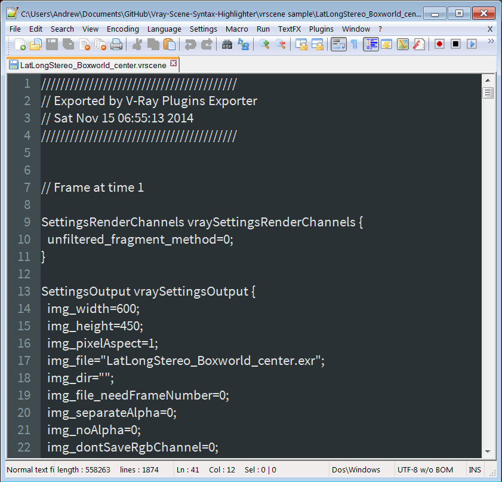
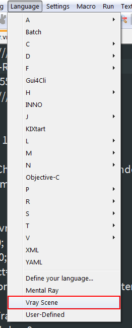

# Vray Scene Syntax Highlighter #
**Version 1.1** Released 2016-12-17  
by Andrew Hazelden

## Overview ##
I would like to present a new Notepad++ syntax highlighting module that works with code from [Chaos Group's Vray Renderer](http://www.chaosgroup.com). The new modules make it easier for a VFX artist or technical director to edit a vray vrscene file.

I created this syntax highlighter to help me as I was porting the Domemaster3D shader's fulldome and latlong stereo shaders from mental ray over to vray standalone.

I hope this tool improves your coding workflow as you develop and edit Vray Scene (.vrscene) files using a plain text editor.

**Note:** The free program Notepad++ is required to use the syntax highlighter.

## Download ##

The Vray Scene Syntax Highlighter module is a free download.

You can download the latest version on GitHub here:   
[https://github.com/AndrewHazelden/Vray-Scene-Syntax-Highlighter/](https://github.com/AndrewHazelden/Vray-Scene-Syntax-Highlighter/)

## Installation ##

**Step 1.**  [Download Notepad++](http://notepad-plus-plus.org/download/v6.4.5.html) and install it on your system. After you start Notepad++ you will see a blank text editing window.

**Step 2.**  The syntax highlighting module has been customized to work with the dark background based **Obsidian** theme. To load the Obsidian theme in Notepad++, go to the **Settings** menu and select **"Style Configurator..."**

In the Style Configurator window select the **Obsidian** theme and click the **Save and Close** button. 

**Step 3.** Let's load the custom "Vray Scene" syntax highlighting module. Open the **Language** menu in Notepad++ and select the **"Define your language..."** menu item. The **User Defined Language** window will load.

**Step 4.** In the **User Defined Language** window, click on the **Import** button to load the XML based language file.

In the open dialog select the **"Vray-Scene.xml"** file and click **open**.

If the file was loaded correctly an "Import Successful" notice will appear.  Click the **OK** button to continue. At this point you should close the "User Defined Language" window by clicking on the window's **X** shaped close button.

**Step 5.**  We need to restart Notepad++ for the new language module to be listed in the Notepad++ language menu.

If you open a Vray Scene  .vrscene file at this point you will see formatted text. If you are working on an include file without the .vrscene extension you can select the language manually.

Open the **Language** menu and select **Vray Scene**. This will turn on syntax highlighting and make it easier to develop complex Vray scene files.
 

Here is an example Vray .vrscene file with Notepad++ based syntax highlighting enabled:

**Bonus Step** If you use the Notepad++ Compare module you can load the new Obsidian theme compatible color palette file "Compare.ini" from the Vray Scene Syntax Highlighter install folder by copying "Compare.ini" to your Notepad++ preferences folder:

    C:\Users\<Your User Account>\AppData\Roaming\Notepad++

* * *

I hope this tool improves your coding workflow as you develop and edit Vray Scene (.vrscene) files using the Notepad++ text editor. I've also created a Vray Scene syntax highlighter for gedit, BBEdit, and TextWrangler.

Cheers,  

Andrew Hazelden

Email: [andrew@andrewhazelden.com](mailto:andrew@andrewhazelden.com)   
Blog: [http://www.andrewhazelden.com](http://www.andrewhazelden.com)  
Twitter: [@andrewhazelden](https://twitter.com/andrewhazelden)  
Google+: [https://plus.google.com/+AndrewHazelden](https://plus.google.com/+AndrewHazelden)

