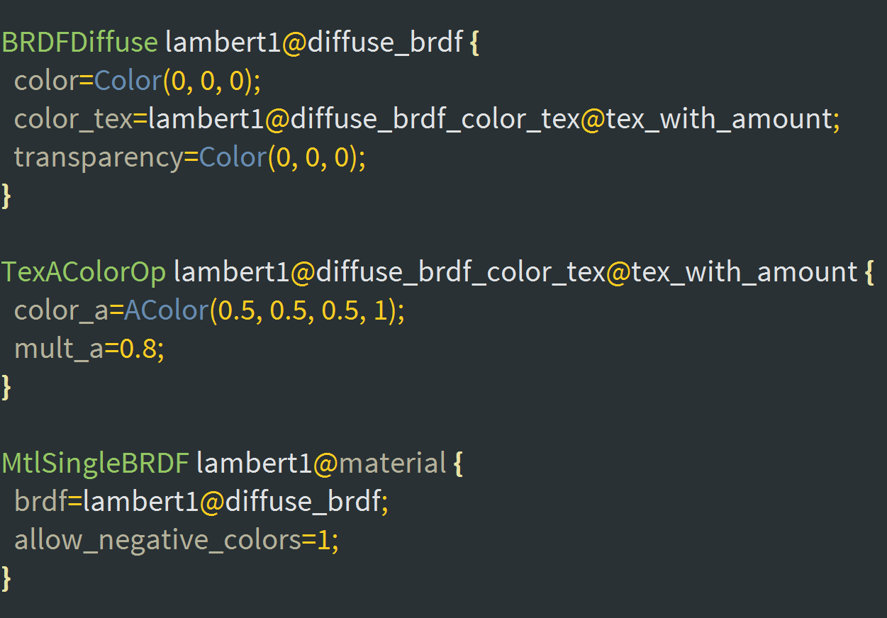

# Vray Scene Syntax Highlighter #
**Version 1.0** Released January 19, 2015  
by Andrew Hazelden  

## Overview ##

I've just finished a set of Notepad++, GEDIT, BBEdit, and TextWrangler syntax highlighting modules for code from [Chaos Group's Vray Renderer](http://www.chaosgroup.com). The new modules make it easier for a VFX artist or technical director to edit a vray vrscene file.

For more details on the Vray vrscene syntax check out the Vray docs page:  
[V-Ray standalone scene format description (.vrscene)](http://help.chaosgroup.com/vray/help/maya/sdk22/vrscene_format.html)

I created this Vray syntax highlighter to help me as I was porting the Domemaster3D shader's fulldome and latlong stereo shaders from mental ray over to vray standalone.

I hope this tool improves your coding workflow as you develop and edit Vray Scene (.vrscene) files using a plain text editor.

Cheers,  
Andrew Hazelden

Email: [andrew@andrewhazelden.com](mailto:andrew@andrewhazelden.com)   
Blog: [http://www.andrewhazelden.com](http://www.andrewhazelden.com)  
Twitter: [@andrewhazelden](https://twitter.com/andrewhazelden)  
Google+: [https://plus.google.com/+AndrewHazelden](https://plus.google.com/+AndrewHazelden)
